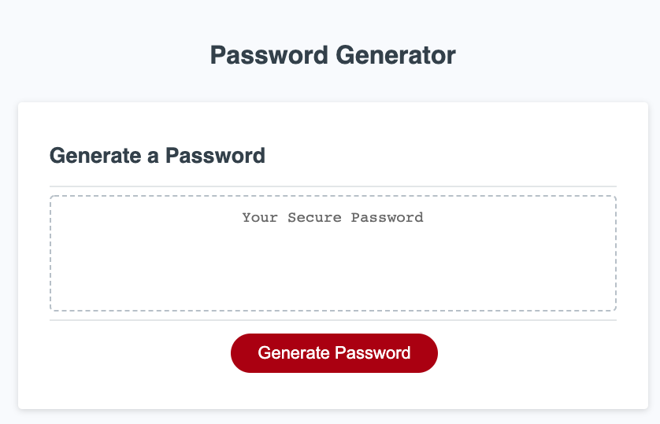
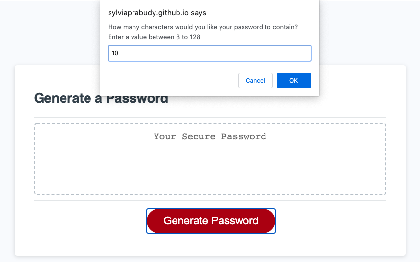
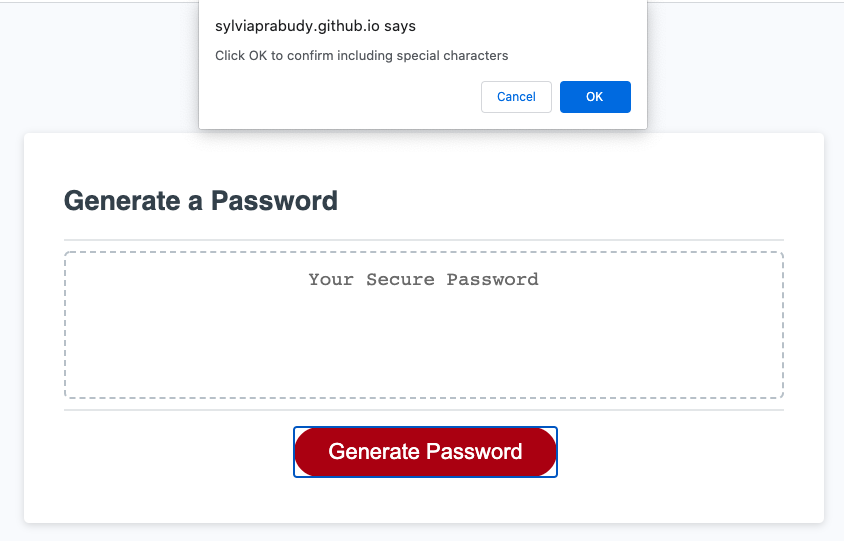
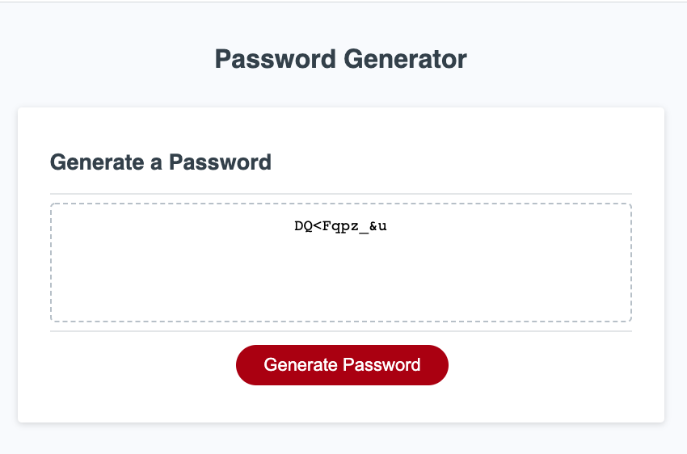

# Password Generator

## Description:

An application that generates a random password based on user-selected criteria. This app runs in the browser and feature dynamically updated HTML and CSS powered by JavaScript code. It features a clean and polished user interface and be responsive, ensuring that it adapts to multiple screen sizes.
 
### URL : https://sylviaprabudy.github.io/password-generator/

## User Story

```
AS AN employee with access to sensitive data
I WANT to randomly generate a password that meets certain criteria
SO THAT I can create a strong password that provides greater security
```

## Acceptance Criteria

```
GIVEN I need a new, secure password
WHEN I click the button to generate a password
THEN I am presented with a series of prompts for password criteria
WHEN prompted for password criteria
THEN I select which criteria to include in the password
WHEN prompted for the length of the password
THEN I choose a length of at least 8 characters and no more than 128 characters
WHEN prompted for character types to include in the password
THEN I choose lowercase, uppercase, numeric, and/or special characters
WHEN I answer each prompt
THEN my input should be validated and at least one character type should be selected
WHEN all prompts are answered
THEN a password is generated that matches the selected criteria
WHEN the password is generated
THEN the password is either displayed in an alert or written to the page
```

## Steps :
1. Go to https://sylviaprabudy.github.io/password-generator/


2. Click generate password. Then enter numeric between 8 to 128


3. Select criteria by clicking OK to include the character selections or Cancel to not include it. Go through all 4 criteria.


4. Your randowm password is generated. Copy the password to use it.



## Contributor:
Sylvia Prabudy © 2020 All Rights Reserved.
- - -

